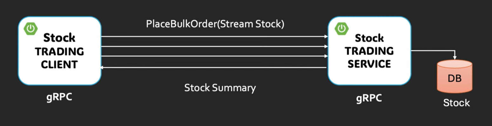

# gRPC Client-Streaming: Stock Trading Client

## Project Overview
A simple Spring Boot Java client demonstrating gRPC streaming patterns, focused on client-streaming and server-streaming examples for a stock trading service. The client connects to a gRPC server (`stockService`) to:
- Subscribe to live stock price updates (server-streaming).
- Send a bulk of stock orders and receive a summary (client-streaming).

## Key Files
- `stock-trading-client/src/main/java/com/javatechie/service/StockClientService.java` — main client logic (subscribe and bulk order streams).
- Protobuf-generated classes under `com.demo.grpc` (messages and stubs).
- `application.properties` or `application.yml` — gRPC client configuration (check for `grpc.client.stockService.address`).

## Prerequisites
- Java 17+ (or project JDK)
- Maven
- Running gRPC server that implements the StockTradingService
- `protoc` only required if you change proto files and regenerate stubs

## Build & Run
- Build: `mvn clean package`
- Run (Spring Boot): `mvn spring-boot:run` or run the generated jar:
  - `java -jar target/<artifact>.jar`
- Ensure gRPC server address configured (example property key: `grpc.client.stockService.address`).

## How It Works (concise)
- Server-streaming (`subscribeStockPrice`):
  - Client sends a single `StockRequest` with a symbol.
  - Server streams multiple `StockResponse` messages over time.
  - Client listens with a `StreamObserver<StockResponse>` and handles `onNext`, `onError`, `onCompleted`.

- Client-streaming (`bulkStockOrder`):
  - Client obtains a `StreamObserver<OrderSummary>` to receive the final summary.
  - Client obtains a `StreamObserver<StockOrder>` request observer from stub.
  - Client sends multiple `StockOrder` messages via `requestObserver.onNext(...)`.
  - After sending all orders, client calls `requestObserver.onCompleted()` to signal end.
  - Server replies once with `OrderSummary` via the response observer.

## Important Concepts & Notes
- StreamObservers:
  - `onNext` — called for each message.
  - `onError` — handle network/errors; observer stream is terminated.
  - `onCompleted` — indicates normal stream completion.
- Threading:
  - gRPC callbacks run on gRPC-managed threads. Avoid blocking operations inside `onNext`; offload to executor when needed.
- Backpressure:
  - gRPC Java has internal flow-control; avoid flooding the channel with huge bursts.
- Error handling:
  - Handle exceptions around `onNext` calls; call `requestObserver.onError(ex)` if interrupted.
- Idempotency:
  - When sending orders, consider idempotency (unique `orderId`) to handle retries.
- Timeouts & retries:
  - Configure deadlines on client calls or handle reconnection logic as needed.
- Configuration:
  - Check Spring gRPC client configuration (e.g., `grpc.client.<name>.address`, TLS settings if applicable).

## Quick Commands & Tips
- Inspect running gRPC server with `grpcurl`:
  - `grpcurl -plaintext <host>:<port> list`
  - `grpcurl -plaintext <host>:<port> describe com.demo.grpc.StockTradingService`
- Regenerate stubs after changing `.proto`:
  - Use Maven plugin or `protoc` + gRPC Java plugin; then rebuild with Maven.
- Logging:
  - Enable Spring Boot logging or add custom logs inside `StreamObserver` callbacks to trace flows.

## Troubleshooting
- "UNAVAILABLE" or connection refused:
  - Verify server is running and the address/port in `application.properties` matches.
- No stream messages:
  - Confirm server sends messages and that the correct symbol is requested.
- Exceptions inside observers:
  - Log exceptions and ensure `onError` is called on the request observer when errors occur.

## Study / Review checklist
- Understand differences: unary vs server-streaming vs client-streaming vs bidi.
- Know `StreamObserver` lifecycle and threading model.
- Practice sending multiple `onNext` messages then `onCompleted`.
- Review `StockClientService` implementation and how response observers are handled.
- Verify proto message fields (e.g., `StockOrder`, `OrderSummary`) and mapping to client code.

## References
- gRPC Java docs: https://grpc.io/docs/languages/java/
- Spring gRPC starter (if used): project documentation for client DI and configuration.
