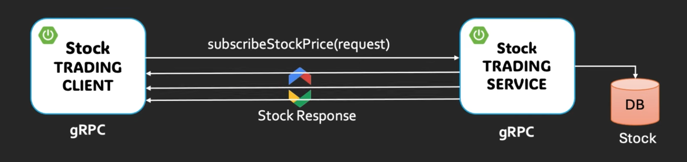

# grpc-server-streaming

Purpose
- Personal revision notes for a Java + Spring Boot project showing gRPC server\-streaming. Focus on concepts and the exact patterns used in this project.

Prerequisites
- Java 17\+
- Maven
- IntelliJ IDEA (you use `2025.2.2`)
- Optional: `protoc` (for manual proto work), `grpcurl` (for quick manual tests)

Quick summary of server\-streaming
- Client sends a single request; server returns 0..N responses then completes.
- Implemented on server side by calling `responseObserver.onNext(...)` repeatedly then `responseObserver.onCompleted()`.
- Avoid blocking gRPC I/O threads; offload heavy work to an executor.

Important files (project-specific)
- `src/main/proto/` \- proto definitions used to generate Java sources.
- `pom.xml` \- Maven config (contains `protobuf-maven-plugin` and gRPC dependencies).
- `src/main/java/.../Application.java` \- Spring Boot entry point.
- `src/main/java/.../ExampleServiceImpl.java` \- gRPC service implementation (server\-streaming).
- `src/test/java/...` \- unit and integration tests.

Example proto (server\-streaming RPC)
```proto
syntax = "proto3";
package example;

message Request {
  string id = 1;
}

message Response {
  string payload = 1;
}

service ExampleService {
  rpc StreamData(Request) returns (stream Response);
}