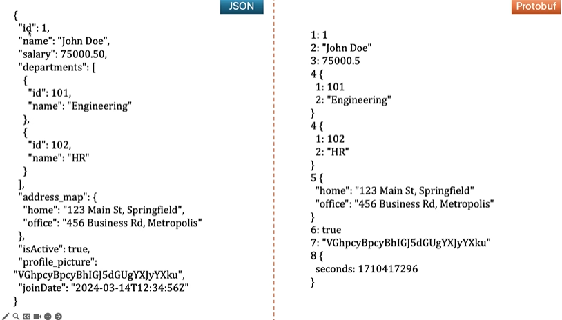

# gRPC and Protobuf Demo

## Overview
This project demonstrates the use of **gRPC** and **Protocol Buffers (Protobuf)** in a Spring Boot application. It includes the definition of contracts, services, and message structures using `.proto` files, and the generation of Java classes for serialization and deserialization.

---

## Key Concepts

### Protocol Buffers (Protobuf)
- **Syntax**: Using `proto3` for simplicity and modern features.
- **Field Numbers**: Each field in a message is assigned a unique number (field tag) for efficient serialization.
- **Compact Representation**: Data is serialized using field tags instead of field names, making it lightweight and fast.

### gRPC
- **Service Definition**: Similar to defining interfaces in Java, services are defined in `.proto` files.
- **RPC Methods**: Remote Procedure Calls (RPC) are defined for communication between client and server.

---

## Project Structure

### `employee.proto`
- **Messages**:
    - `Employee`: Represents an employee with fields like `id`, `name`, `salary`, etc.
    - `Department`: Represents a department with `id` and `name`.
    - `EmployeeRequest`: Input for fetching an employee by ID.
    - `EmployeeList`: Output for returning a list of employees.
    - `Empty`: Used for methods that take no input.
- **Service**:
    - `EmployeeService`:
        - `getEmployee`: Fetch an employee by ID.
        - `addEmployee`: Add a new employee.
        - `getAllEmployees`: Fetch all employees.

---

## Steps to Run

1. **Generate Java Classes**:
    - Use Maven to generate Java classes from the `.proto` file:
        - Navigate to `Maven` -> `protobuf-demo` -> `Lifecycle` -> `install`.
    - Check the `target` folder for the generated classes.

2. **Run the Application**:
    - Start the Spring Boot application to expose the gRPC services.

3. **Test the Services**:
    - Use a gRPC client to test the methods defined in `EmployeeService`.

---

## Why Use Protobuf and gRPC?

- **Protobuf**:
    - Compact and efficient serialization.
    - Faster than JSON or XML.
- **gRPC**:
    - High-performance communication.
    - Supports multiple languages.
    - Built-in support for streaming.

---

## Notes
- The `google.protobuf.Timestamp` type is imported for handling date fields.
- The `java_multiple_files` option is enabled to generate separate Java files for each message.
- Refer to the `resources` folder for additional details and images.

---

## Tools and Dependencies
- **Languages**: Java
- **Frameworks**: Spring Boot
- **Build Tool**: Maven
- **Protobuf Plugin**: For generating Java classes from `.proto` files
- **gRPC**: For defining and implementing services

