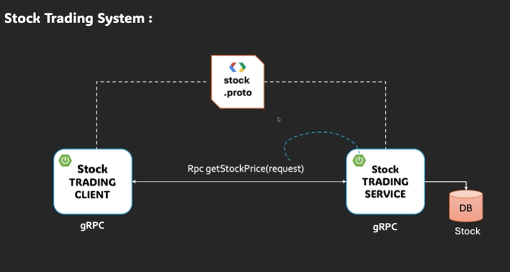

# unary-client-demo (stock-trading-client)

Project: simple gRPC unary client that calls `StockTradingService.getStockPrice` on a running unary-server-demo.

## Overview
1. Purpose: act as a client for testing the `unary-server-demo`. It sends a unary request for a stock symbol and prints the server response at startup.
2. Java / Spring Boot / Maven project targeting Java 17.

3. Images
------
Inline images (these will display on Git hosting that supports relative paths):

Unary concept diagram:

-----------

## Important files
1. `src/main/java/com/demo/unaryclientdemo/UnaryClientDemoApplication.java`
    - Spring Boot `CommandLineRunner` that calls the client service and prints response for `"GOOGL"`.
2. `src/main/java/com/demo/unaryclientdemo/service/StockClientService.java`
    - Uses `@GrpcClient("stockService")` to inject a blocking stub: `StockTradingServiceGrpc.StockTradingServiceBlockingStub`. Method: `getStockPrice(String symbol)`.
3. `src/main/proto/stock_tradig.proto`
    - Proto defines package `stocktrading`, service `StockTradingService` with rpc `getStockPrice(StockRequest) returns (StockResponse)`. (Note: filename contains a typo: `stock_tradig.proto`.)
4. `src/main/resources/application.yaml`
    - gRPC client configuration for `stockService`:
        - address: `static://localhost:9090`
        - negotiationType: `PLAINTEXT`
5. `src/main/resources/application.properties`
    - `spring.application.name=stock-trading-client`
6. `pom.xml`
    - Spring Boot parent `3.4.12`, Java 17, gRPC/protobuf versions defined in properties and a protobuf maven plugin configured to generate Java code.

## Build & run
1. Ensure the server (`unary-server-demo`) is running and listening on `localhost:9090`.
2. Build:
    - `mvn clean package`
3. Run:
    - `mvn spring-boot:run`
    - or run packaged jar: `java -jar target/unary-client-demo-0.0.1-SNAPSHOT.jar`
4. Output: the client prints the `StockResponse` to the console from `UnaryClientDemoApplication`.

## Protobuf / code generation
1. Proto details:
    - `syntax = "proto3"`
    - `package stocktrading`
    - Java options: `option java_package = "com.demo"; option java_outer_classname = "StockTradingProto";`
2. Generated sources location (Maven default): `target/generated-sources/protobuf`
3. Plugin used: `io.github.ascopes:protobuf-maven-plugin` (configured in `pom.xml`), with:
    - `protocVersion` set from property `protobuf-java.version` (4.32.1)
    - `protoc-gen-grpc-java` binary plugin for gRPC stubs using `grpc.version` (1.76.0)

## Key configuration details (notes)
1. gRPC client bean name: `stockService` (matches `@GrpcClient("stockService")` and `application.yaml`).
2. Connection: plaintext (`PLAINTEXT`) to `localhost:9090` — no TLS.
3. Application name: `stock-trading-client` (from `application.properties`).

## Dependencies to notice (extra / not always standard)
1. `net.devh:grpc-client-spring-boot-starter:2.15.0.RELEASE`
    - Spring Boot starter that provides `@GrpcClient` injection and client support.
2. `io.github.ascopes:protobuf-maven-plugin:3.8.0`
    - Not the usual `protobuf-maven-plugin` group; configured to drive protoc generation here.
3. `io.grpc:grpc-services` (no explicit version in pom for this artifact)
    - Version likely resolved via `dependencyManagement` (`org.springframework.grpc:spring-grpc-dependencies`).
4. `io.grpc:grpc-census`
    - Additional gRPC dependency present in `pom.xml`.
5. `org.springframework.grpc:spring-grpc-dependencies` (imported via `dependencyManagement`)
    - Controls compatible versions for Spring gRPC artifacts.

## Notes / gotchas
1. The client only works if the server implements `StockTradingService.getStockPrice` and listens on `localhost:9090`.
2. Proto filename typo: `stock_tradig.proto` — keep this name or rename and update build if you change it.
3. If `grpc-services` or other artifacts resolve unexpectedly, check `dependencyManagement` for versions.
4. Generated package for protobuf messages and stubs is `com.demo`, matching imports in Java code.

## Quick concept recap (as study notes)
1. Unary RPC: client sends a single `StockRequest`, server returns a single `StockResponse`.
2. Blocking stub: synchronous call pattern used in `StockClientService`.
3. `@GrpcClient("name")` binds to a configured client in `application.yaml`.
4. Protobuf → Java generation is handled by Maven plugin + `protoc-gen-grpc-java`.
5. Plaintext negotiation is used for local testing; enable TLS for production.

## Minimal checklist before running
1. Start `unary-server-demo` on `localhost:9090`.
2. Build the client: `mvn clean package`.
3. Run the client: `mvn spring-boot:run` or `java -jar target/...jar`.
