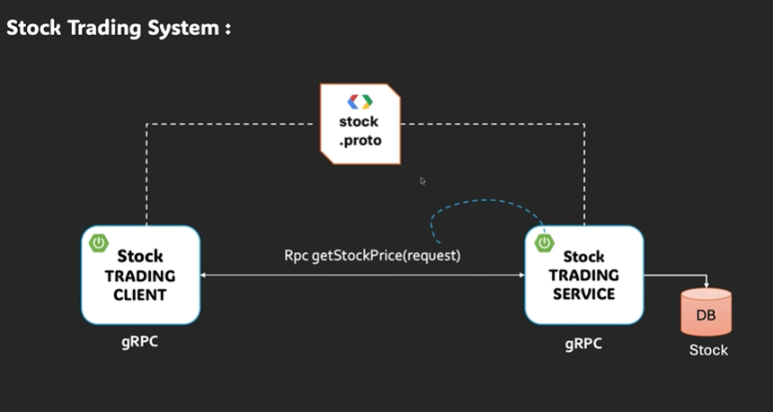
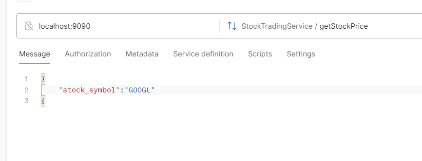

# Unary-server-demo (gRPC) 


Project overview
----------------
This is a simple Spring Boot gRPC project that demonstrates a unary RPC: a client sends a `StockRequest` (a single stock symbol) and the server returns a `StockResponse` containing the symbol, current price and a timestamp.

The project uses:
- Protocol Buffers (proto3) to define the RPC and messages.
- Generated Java gRPC stubs (under `generated-sources` / compiled into `target/classes`).
- Spring Boot to host the gRPC service (the service implementation is annotated with `@GrpcService`).
- JPA entity `Stock` (backed by a relational DB) to persist stock prices.

This repo is useful for revising unary gRPC concepts, how proto -> Java mapping works, and how a Spring Boot service can expose a gRPC endpoint.

Project layout / important files
-------------------------------
Key files and what to open when studying:
- `src/main/proto/stock_tradig.proto` — the protobuf definition (service + messages).
- `generated-sources/protobuf/...` and `target/classes/com/demo/*.class` — generated Java message classes and gRPC stubs.
- `src/main/java/com/demo/unarydemo/service/StockServiceTradingImpl.java` — server-side implementation of the unary RPC.
- `src/main/java/com/demo/unarydemo/entity/Stock.java` — JPA entity representing a stock.
- `src/main/java/com/demo/unarydemo/repo/StockRepo.java` — repository used by the service (search the codebase for its declaration).
- `src/main/resources/application.properties` / `application.yaml` — Spring Boot and datasource configuration.
- Images: `src/main/resources/unary.png` (unary concept), `src/main/resources/postman.png` (how to call from Postman).

Protobuf (stock_tradig.proto) — what it defines
----------------------------------------------
Open: `src/main/proto/stock_tradig.proto`

Important points to remember:
- syntax = "proto3" — the modern proto syntax with default values and simpler semantics.
- package (in proto): `stocktrading` — this is the protobuf namespace used to form the gRPC full service name.
- options for Java generation:
  - `option java_package = "com.demo";` — generated Java classes live in `com.demo` package.
  - `option java_outer_classname = "StockTradingProto";` — outer helper class name for messages (if generated into a single Java file).
- Service defined: `StockTradingService` with RPC `getStockPrice(StockRequest) returns (StockResponse)` — a unary RPC.

Message mapping notes (proto -> Java):
- `StockRequest` and `StockResponse` are generated as Java classes in `com.demo` package.
  - builder pattern used: `StockResponse.newBuilder().setPrice(...).build()`
- Full RPC service name (used by grpcurl / grpc clients): `stocktrading.StockTradingService` with method name `getStockPrice`.

Generated code (what to look for)
---------------------------------
Generated classes are in `generated-sources/protobuf` during build and in `target/classes/com/demo` when packaged.
Key generated types:
- `com.demo.StockRequest` (message)
- `com.demo.StockResponse` (message)
- `com.demo.StockTradingServiceGrpc` (contains `StockTradingServiceImplBase` that your server extends and client stubs)

Open `StockTradingServiceGrpc` to see:
- `StockTradingServiceImplBase` — extend this to implement server logic.
- `StockTradingServiceStub`, `StockTradingServiceBlockingStub`, `StockTradingServiceFutureStub` — client stubs.

Server implementation: `StockServiceTradingImpl`
----------------------------------------------
Open: `src/main/java/com/demo/unarydemo/service/StockServiceTradingImpl.java`

What it does (current implementation summary):
- The class extends `StockTradingServiceGrpc.StockTradingServiceImplBase` (through the generated base) and is annotated with `@GrpcService` so Spring will register it.
- It receives a `StockRequest` and uses `StockRepo` to look up a `Stock` entity by symbol.
- It maps the entity to a `StockResponse` and uses the `StreamObserver` to send the single response and complete the call.

Important behavior & gotchas to revise here:
- The RPC is unary; the server will call `responseObserver.onNext(response)` once and then `responseObserver.onCompleted()`.
- If an exception occurs (for example the stock isn't found), the server should call `responseObserver.onError(Status.NOT_FOUND.withDescription("...").asRuntimeException())` rather than letting a NullPointerException be thrown — gRPC expects you to report errors through `onError`.
- The repository method `findByStockSymbol(...)` may return `null`. Add defensive checks to return a gRPC NOT_FOUND status with a helpful description.

Example handling idea (conceptual, not changing code here):
- If `stockEntity == null` ->
  responseObserver.onError(io.grpc.Status.NOT_FOUND.withDescription("stock not found: " + stockSymbol).asRuntimeException());

Persistence: `Stock` entity and `StockRepo`
-----------------------------------------
Open: `src/main/java/com/demo/unarydemo/entity/Stock.java` — an annotated JPA entity. Important fields:
- `Long id` — primary key
- `String stockSymbol` — unique stock symbol (column name `stock_symbol`)
- `double price` — the current price
- `LocalDateTime lastUpdated` — timestamp when the price was updated

Notes about the DB and running locally:
- Check `src/main/resources/application.properties` / `application.yaml` to see what datasource is configured. If nothing is configured, add an in-memory H2 config for quick local testing.
- Example quick H2 config (application.properties):
  spring.datasource.url=jdbc:h2:mem:testdb
  spring.datasource.driverClassName=org.h2.Driver
  spring.jpa.hibernate.ddl-auto=create-drop
  spring.h2.console.enabled=true

- To manually seed the DB, create an SQL file under `src/main/resources/data.sql` with rows such as:
  INSERT INTO stocks (stock_symbol, price, last_updated) VALUES ('AAPL', 173.45, '2025-11-27T10:00:00');

Building & running the app
--------------------------
From the project root on Windows (using the included wrapper):

```bat
mvnw.cmd clean package
mvnw.cmd spring-boot:run
```

Or build and run the fat JAR:

```bat
mvnw.cmd clean package
java -jar target\unary-demo-0.0.1-SNAPSHOT.jar
```

By default the gRPC server commonly binds to port 9090 (check `application.yaml`/`application.properties` to confirm). If a different port is configured, use that.

Testing the unary RPC
---------------------
The RPC: method name is `getStockPrice`, the full protobuf service name is `stocktrading.StockTradingService` and it takes a JSON/Proto message like `{ "stock_symbol": "AAPL" }`.

1) Test with grpcurl (quick CLI testing)
- Install `grpcurl` (https://github.com/fullstorydev/grpcurl). Example call (assuming server runs on `localhost:9090` and accepts plaintext):

```bat
grpcurl -plaintext -d "{\"stock_symbol\":\"AAPL\"}" localhost:9090 stocktrading.StockTradingService/getStockPrice
```

Notes:
- Use `-insecure` / TLS flags if your server uses TLS.
- The full service name follows the proto `package` prefix (here `stocktrading`).

2) Test with Postman (gRPC support)
- Open Postman.
- Click New -> gRPC Request.
- In the address enter: `localhost:9090` (or include host:port from your config).
- Click the dropdown to select the service: choose `stocktrading.StockTradingService` and then `getStockPrice`.
- In the request body choose `JSON` and enter:
  { "stock_symbol": "AAPL" }
- Click "Invoke".

See the screenshot at `src/main/resources/postman.png` for a visual of the Postman UI / steps.

Troubleshooting & edge cases
----------------------------
- NullPointerException on service call: make sure `StockRepo.findByStockSymbol(...)` does not return `null` without being handled. Add a check and call `responseObserver.onError(Status.NOT_FOUND...)` where appropriate.
- DB not initialized / table missing: ensure your datasource is configured (H2 for dev) and that JPA has created the table or provide schema.sql.
- Wrong service name in grpcurl or Postman: verify `package` in .proto — the fully-qualified service name will be `package.ServiceName` (here `stocktrading.StockTradingService`). The method name is exactly `getStockPrice`.
- Port in use or wrong port: check `application.properties`/`application.yaml` for `grpc.server.port` (if using grpc-spring-boot-starter) or other relevant config.

Suggested improvements (exercise list for revision)
--------------------------------------------------
- Add defensive error handling in `getStockPrice` to return gRPC Status codes (NOT_FOUND, INVALID_ARGUMENT, INTERNAL) instead of throwing exceptions.
- Add validation: reject empty or blank `stock_symbol` with `Status.INVALID_ARGUMENT`.
- Add unit tests for the service:
  - happy path returning a known stock
  - missing stock -> asserts NOT_FOUND error
- Add integration test using an in-memory DB (H2) and the Spring Boot test slice for gRPC (or start the app on a random port)
- Add an endpoint to update stock prices (unary RPC for update, or server-stream for pushing price updates).
- Add TLS to the gRPC server and demonstrate secure grpcurl / Postman configuration.

Notes & memory joggers (short glossary)
--------------------------------------
- Unary RPC: single request, single response. Server uses responseObserver.onNext(...) once and responseObserver.onCompleted().
- StreamObserver: the server-side stream observer has methods `onNext`, `onError`, `onCompleted`.
- Protobuf package vs Java package: `package` in `.proto` affects RPC full names; `option java_package` controls the Java package name of generated classes.
- Generated gRPC base class: extend `StockTradingServiceGrpc.StockTradingServiceImplBase` and override methods.
- Use `StatusRuntimeException` via `io.grpc.Status.XYZ.asRuntimeException()` to send structured gRPC errors.

Images
------
Inline images (these will display on Git hosting that supports relative paths):

Unary concept diagram:



Postman example screenshot:



Final notes
-----------
This README is intentionally detailed so you can revise the core concepts used in this repo. If you want, I can also:
- Add a short unit test that asserts the `getStockPrice` method behavior (happy path + not-found).
- Update `StockServiceTradingImpl` to handle errors defensively and commit that change for you.

Tell me which of the extra tasks you want me to do next (tests, defensive fixes, seed SQL, or CI integration) and I'll implement them.

